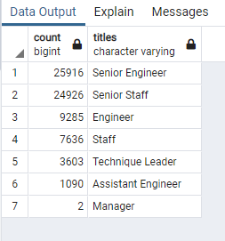
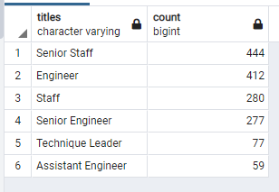

# Pewlett-Hackard-Analysis

**Overview of the analysis:**

As the "silver tsunami" is approaching, the manager would like to know the number of retiring employees per title for each departments and whether they have enough employees who will be eligible for mentorship program which can replace those retirees after they leave the company. 

**Results:**

* About 70% of the retiring employees are senior engineers and senior staff. Therefore, these two positions should be the top priorities when the company enroll eligible employees for the mentorship program. 

* Among the 1550 eligible employees, only 277 are senior engineers and 444 are senior staff. Once they completed the mentorship program, these employees can only fill 1.0% of the retired senior engineer and 1.8% of the senior staff. 

* The analysis also showed that 2 managers positions may remain as vacant until someone become eligible to the mentorship program. However, given there are only 2 managers retiring, this will be the least concern. 

* Given the eligible employees can only filled approximately 2.1% of the retiring positions, this mentorship program still cannot resolves the issue of vacant positions. 

**Summary:**
1. How many roles will need to be filled as the "silver tsunami" begins to make an impact?

Based on the result of the analysis, it seems like senior enginners and senior staff should be the top priorities given they made up almost 70% of the retirees. However, we should also group the retiring titles by age to determine exactly which positions will be in need th most. 

2. Are there enough qualified, retirement-ready employees in the departments to mentor the next generation of Pewlett Hackard employees?

Yes, there is an abundance of qualified, retirement - ready employees in the department for the mentorship program given the eligible employees is approximately 2.1% of the retiring employees. 

*Additional Queries:*
Instead of only having the eligible employee with birth year of 1965, we can expand the elibigibility by 1 - 2 years younger to increas the number of eligible employees. In addition, we can also group the retirees by years and titles which it will help the company to make the accurate decisions when it comes to hiring new satff and enrolling the eligible employees for mentorship.
